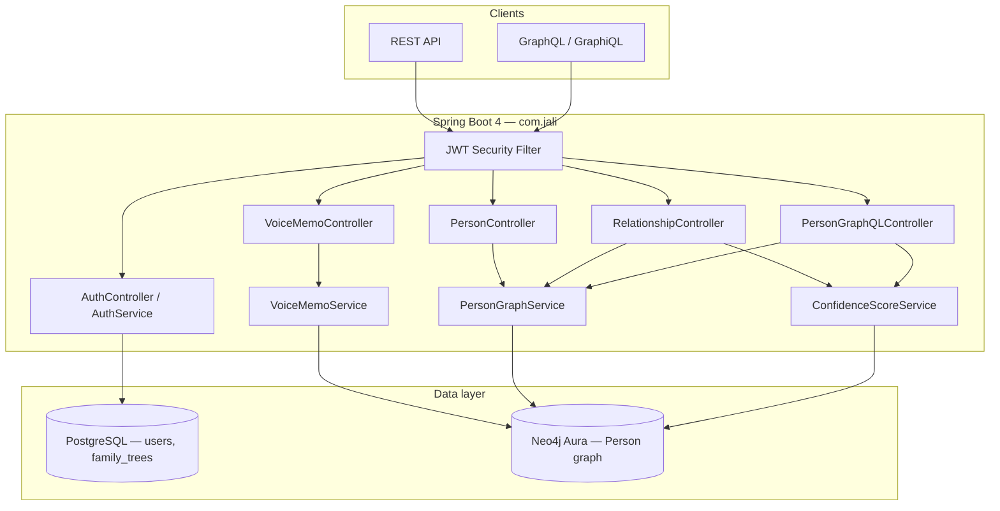

# Jali

**Jali** is a family heritage platform for preserving lineage across generations. It's built for oral history, probabilistic confidence on relationships, and diaspora family trees.

> *Jali* (Mandinka): the griot, keeper of oral history, memory, and family lineage.

This repository is **proprietary**. See [LICENSE](LICENSE). No copying, redistribution, or commercial use without written permission.

---

## Architecture

Jali uses a **dual-database** backend: PostgreSQL for identity and tenancy, Neo4j for the family graph.



### Why dual-database?

PostgreSQL handles identity and tenancy: users, family tree ownership, billing, and access control. These are relational problems: a user has one account, owns one tree, and that maps naturally to rows and foreign keys.

Neo4j handles the family graph because a family tree is fundamentally a graph problem, not a relational one. Finding all ancestors 10 generations back in PostgreSQL requires 10 recursive self-joins, and cost grows with every degree of separation. In Neo4j, relationships are stored as direct pointers between nodes (index-free adjacency), so traversing from person to person is a constant-time operation regardless of depth. The query `MATCH (p:Person)-[:PARENT_OF*1..10]->(ancestor)` is idiomatic and fast; the SQL equivalent is neither.

The complexity cost of running two databases is real. It's justified here because the core product feature, deep lineage traversal with confidence-weighted paths, is a graph problem that a relational database solves poorly at scale.

### Package layout

```
com.jali/
├── JaliApplication.java          # Entry; JPA + Neo4j repo scanning
├── config/                       # Security, JWT, Neo4j/JPA transaction managers, seeder
├── controller/                   # REST + GraphQL controllers
├── service/                      # Auth, graph ops, confidence scoring
├── repository/
│   ├── jpa/                      # UserRepository, FamilyTreeRepository
│   └── neo4j/                    # PersonRepository (Cypher queries)
├── entity/                       # JPA: User, FamilyTree, Role
├── neo4j/                        # SDN nodes: Person, PARENT_OF, MARRIED_TO, SIBLING_OF
├── dto/                          # REST request/response records
└── security/                     # JWT filter, JwtService, UserPrincipal
```

### Design decisions

| Concern | Approach |
|--------|----------|
| **Tenancy** | Each user owns a `familyTreeId` (Postgres). All graph nodes carry `familyTreeId`; queries are scoped by JWT. |
| **Graph model** | `Person` nodes with relationship edges (`PARENT_OF`, `MARRIED_TO`, `SIBLING_OF`). Edge properties hold `confidenceScore`, `evidenceList`, `disputed`. |
| **Confidence** | `EvidenceType` weights + `ConfidenceScoreService`; evidence stored as JSON on edges. |
| **Transactions** | Explicit `transactionManager` (JPA) and `neo4jTransactionManager` — required when both stacks are active. |
| **APIs** | REST for CRUD + evidence; GraphQL for flexible tree reads (including edge confidence in `PersonEdge`). |

### Tech stack

- Java 21, Spring Boot 4.0.6
- PostgreSQL 16 (Docker) — auth & family trees
- Neo4j Aura — graph storage
- Spring Data JPA + Spring Data Neo4j
- Spring Security + JWT (jjwt)
- Spring GraphQL + GraphiQL

---

## Prerequisites

- Java 21
- Docker (for local Postgres)
- Neo4j AuraDB Free instance ([neo4j.com/cloud/aura](https://neo4j.com/cloud/aura/)) — free tier, no credit card required

---

## Local setup

### 1. Postgres

```bash
docker compose up -d
```

Postgres listens on **host port 5433** (avoids conflict with a local install on 5432).

### 2. Neo4j credentials

```bash
cp src/main/resources/application-local.properties.example \
   src/main/resources/application-local.properties
```

Edit `application-local.properties` with your Aura URI, username, and password. This file is gitignored.

### 3. Run

```bash
./mvnw spring-boot:run
```

Health check: `GET http://localhost:8080/health`

---

## API overview

### Auth (public)

| Method | Path | Description |
|--------|------|-------------|
| POST | `/auth/register` | Create account + family tree |
| POST | `/auth/login` | Obtain JWT |

All other endpoints require: `Authorization: Bearer <token>`

### REST (JWT)

| Method | Path | Description |
|--------|------|-------------|
| POST | `/people` | Create person |
| GET | `/people` | List people in your tree |
| GET | `/people/{uuid}` | Get person |
| GET | `/people/{uuid}/ancestors` | Ancestors (depth param) |
| GET | `/people/{uuid}/descendants` | Descendants (depth param) |
| POST | `/relationships` | Link two people |
| POST | `/relationships/evidence` | Add evidence to an edge |

### Voice memos (JWT)

Oral history pipeline: upload audio → Whisper transcription → user review → Claude extraction → apply to graph.

| Method | Path | Description |
|--------|------|-------------|
| POST | `/voice-memos` | Upload audio (`multipart/form-data`: `file`, optional `anchorPersonUuid`) |
| GET | `/voice-memos/{uuid}` | Get memo status, transcript, applied changes |
| PATCH | `/voice-memos/{uuid}/transcript` | Edit transcript before confirm (`application/json` body: raw string) |
| POST | `/voice-memos/{uuid}/confirm` | Run Claude extraction and apply suggestions |
| POST | `/voice-memos/{uuid}/undo` | Undo within 24 hours of confirm |

**Status lifecycle:** `PENDING_TRANSCRIPTION` → `PENDING_REVIEW` → `APPLIED` (or `FAILED`). Undo sets `UNDONE`.

**Frontend flow (suggest + confirm):** Treat voice memos as *proposals*, not automatic truth.

1. Upload with optional `anchorPersonUuid` (recommended — helps pronoun resolution).
2. Poll `GET /voice-memos/{uuid}` until `status` is `PENDING_REVIEW` or `FAILED`.
3. Show `transcript` to the user; let them **edit** via `PATCH .../transcript` (fix misheard or ambiguous names).
4. On confirm, show `mentionedPeople` and `appliedChangesJson`. Nothing creates new relationships; evidence only applies to **existing** edges.
5. Offer undo while `status` is `APPLIED` and within 24 hours.

Requires `openai.api.key` and `anthropic.api.key` in `application-local.properties` (see example file).

### GraphQL

- Endpoint: `POST /graphql`
- Playground: `http://localhost:8080/graphiql`
- Schema: `src/main/resources/graphql/schema.graphqls`

In GraphiQL, add headers:

```json
{
  "Authorization": "Bearer YOUR_JWT_HERE"
}
```

Example query:

```graphql
query {
  person(uuid: "YOUR_PERSON_UUID") {
    fullName
    children {
      person { fullName }
      confidenceScore
      disputed
    }
  }
}
```

---

## Frontend development

CORS is enabled for local Vite/React dev servers. Default allowed origins:

- `http://localhost:5173` (Vite)
- `http://localhost:3000` (Create React App)

Override in `application.properties`:

```properties
jali.cors.allowed-origins=http://localhost:5173,http://localhost:3000
```

Send the JWT on every API call:

```
Authorization: Bearer <token>
```

For GraphQL from the browser, `POST /graphql` with the same header. GraphiQL remains public at `/graphiql` for manual testing.

**Recommended API split for the UI:**

| UI concern | API |
|------------|-----|
| Login / register | REST `/auth/*` |
| Tree visualization | GraphQL `person`, `myTree` |
| Create people / links | REST `/people`, `/relationships` |
| Voice memos | REST `/voice-memos/*` (multipart upload via `FormData`) |

---

## Configuration

| File | Purpose |
|------|---------|
| `application.properties` | Defaults (Postgres URL, JWT, GraphiQL, CORS) |
| `application-local.properties` | Neo4j + OpenAI + Anthropic secrets (not committed) |
| `docker-compose.yml` | Local Postgres |

---

## Author

**Nvafeomo K. Konneh**

- **Email:** [nvafeomo05@gmail.com](mailto:nvafeomo05@gmail.com)
- **LinkedIn:** [Nvafeomo Konneh](https://www.linkedin.com/in/nvafeomo-konneh-a6a1a9367)

---

## License

**Proprietary — All Rights Reserved.**

Unauthorized copying, modification, distribution, or commercial use is prohibited. See [LICENSE](LICENSE) for full terms.

Third-party dependencies (Spring Boot, Neo4j driver, and others) remain under their respective open-source licenses.
